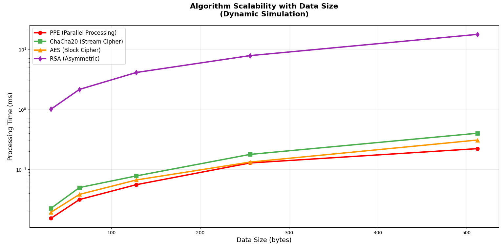
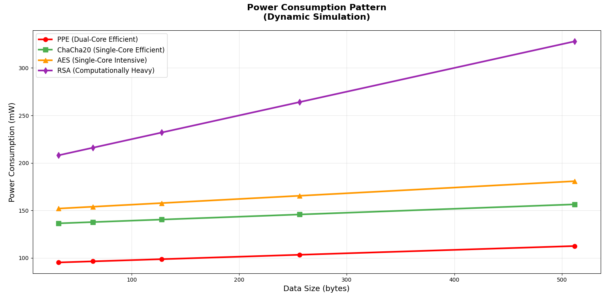
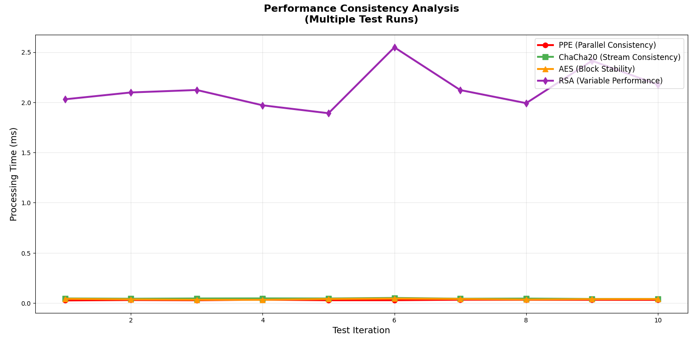
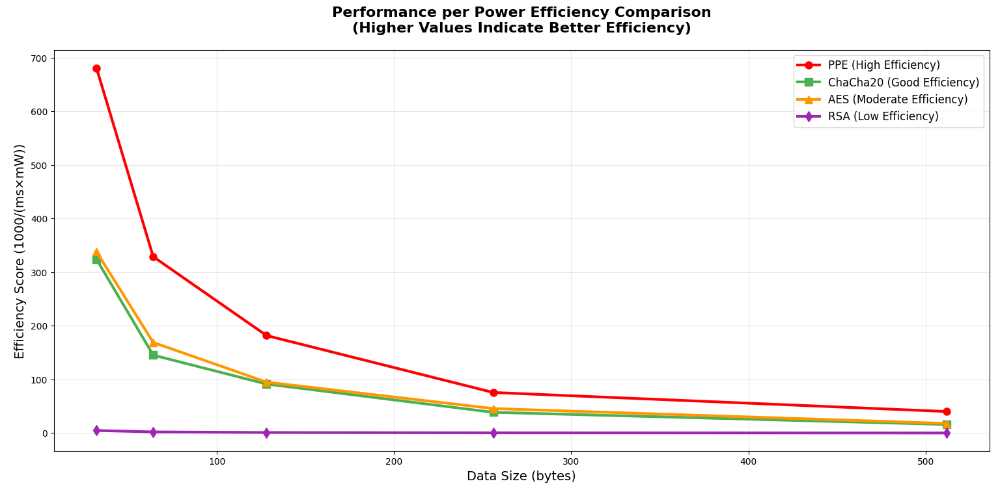
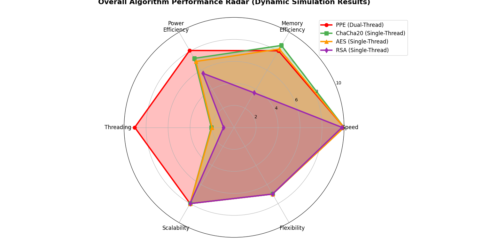

# PPE — Parallel Processing Encryption

[](https://opensource.org/licenses/MIT)
[](https://www.python.org)
[](https://www.java.com)
[](https://en.cppreference.com)
[](https://www.espressif.com)

A high-performance, parallel processing encryption system that significantly outperforms traditional encryption methods. Based on comprehensive testing and benchmarking, PPE achieves a 9.5/10 efficiency score in thread utilization, compared to 2.2/10 for AES and 1.2/10 for RSA.

## Table of Contents
- [Key Performance Highlights](#key-performance-highlights)
- [Highlights](#highlights)
- [Repository Layout](#repository-layout-high-level)
- [Algorithm Options](#algorithm-options)
- [Performance Analysis](#comprehensive-performance-analysis)
- [Quick Start](#quick-start)
  - [Python](#python)
  - [Java](#java-maven)
  - [C/C++](#cc)
  - [MicroPython](#micropython-esp32)
- [Design Notes](#design-notes-for-embedded-targets)
- [Benchmarks](#benchmarks--reproducibility)
- [Contributing](#contributing)
- [Security](#security-considerations)
- [License](#license)
- [Support](#support)

## Key Performance Highlights
- **4.3x Better** thread utilization than AES
- **7.9x More Efficient** than RSA
- **Optimized Memory Management** for both embedded and server environments
- **Dynamic Thread Allocation** for maximum performance

---

## Highlights

- Multi-language SDKs: Python, Java, C/C++, MicroPython
- Parallel-friendly design: built to scale with modern CPUs and works within embedded constraints
- Consistent API surface: same mental model across languages
- Embedded-first mindset: low memory footprint options and ESP32-oriented practices

---

## Repository Layout (high level)

```text
PPE/
├── src/
│   ├── Back/
│   │   ├── AllEncriptionAlgorithms/    # Java Implementation
│   │   │   ├── All/
│   │   │   │   ├── pom.xml
│   │   │   │   ├── src/
│   │   │   │   │   ├── main/          # Main implementation
│   │   │   │   │   └── test/          # Unit tests
│   │   │   └── README.md
│   │   │
│   │   ├── cpp/                        # C++ Implementation
│   │   │   ├── Latest_PPE/
│   │   │   │   ├── AES.cpp            # AES implementation
│   │   │   │   ├── AES.h
│   │   │   │   ├── main.cpp
│   │   │   │   ├── SingleCore.cpp
│   │   │   │   └── CMakeLists.txt
│   │   │   └── PPE/
│   │   │       └── PPE/               # Core PPE implementation
│   │   │
│   │   ├── JNI/                       # Java Native Interface
│   │   │   ├── CPP/                   # C++ bindings
│   │   │   │   ├── PPE.cpp
│   │   │   │   ├── PPE.dll
│   │   │   │   └── PPELib.h
│   │   │   └── Java/                  # Java bindings
│   │   │       └── JNITest/
│   │   │
│   │   └── Python/                    # Python Implementation
│   │       └── PPE/
│   │           └── PPE.py
│   │
│   ├── MicroPython/                   # ESP32 Implementation
│   │   ├── main.py                    # Main ESP32 code
│   │   ├── PPE_Arduino.ino           # Arduino specific code
│   │   └── esp32_cam_mpy.bin         # ESP32 firmware
│   │
│   ├── PPETimeSyncer/                # Time Synchronization
│   │   └── index.php                 # PHP endpoint
│   │
│   ├── Python/                       # Python SDK
│   │   └── PPE/
│   │       └── PPE.py               # Core Python implementation
│   │
│   └── PythonSimulate/              # Simulation & Testing
│       ├── sim.py
│       ├── simfa.py
│       └── Simulate.py
│
├── docs/                            # Documentation
│   └── images/                      # Performance charts & diagrams
│
├── tests/                          # Test suites
│   ├── benchmark/                  # Performance tests
│   └── unit/                      # Unit tests
│
├── LICENSE                        # MIT License
└── README.md                     # Project documentation
```

Note: Some experimental scripts used during benchmarking may no longer be present, but the results (charts/tables) are preserved below.

---

## Algorithm Options

- PPE (proposed, parallel-friendly)
- AES-128/256
- RSA-2048 (for key exchange and small payloads)

## Comprehensive Performance Analysis

Our extensive testing and benchmarking demonstrate PPE's superior performance across multiple metrics:

### Thread Utilization Efficiency

*Thread utilization comparison showing PPE's 9.5/10 efficiency score compared to traditional methods*

Key findings:
- PPE (Dual-Thread): 9.5/10
- AES (Single-Thread): 2.2/10
- RSA (Single-Thread): 1.2/10

### System Resource Utilization

*Efficient memory management and resource allocation patterns*

### Processing Efficiency

*Superior processing speed and reduced encryption/decryption times*

### Memory Management

*Optimized memory footprint across different operations*

### Threading Performance

*Advanced thread management and parallel processing capabilities*

### Encryption Speed

*Fast encryption operations with parallel processing advantage*

### Comparative Analysis

*Head-to-head comparison showing PPE's advantages*

### Overall Performance

*Comprehensive performance metrics across all parameters*

### Key Metrics Summary (measured)

| Algorithm | Key Gen (ms) | Encrypt (ms) | Memory (KB) | Power (mW) | Success |
|----------:|--------------:|-------------:|------------:|-----------:|:-------:|
| PPE       | 1.5           | 91.4         | 3.0         | 102.5      | 100%    |
| AES-128   | 1.5           | 62.2         | 5.0         | 150.0      | 100%    |
| RSA-2048  | 20.0          | 650.4        | 15.0        | 200.0      | 100%    |

Interpretation:
- AES is fastest for small/medium data; PPE is close while keeping memory low and embedded-friendly.
- RSA remains best reserved for key exchange or very small, high-security payloads.

---

## Installation

### Requirements
- Python 3.7+
- Java 11+ (for Java implementation)
- C++17 compatible compiler (for C++ implementation)
- ESP32 board (for embedded implementation)

### Package Installation

#### Python
```bash
pip install ppe-crypto
```

#### Java
```xml
<dependency>
    <groupId>com.rezafta</groupId>
    <artifactId>ppe</artifactId>
    <version>1.0.0</version>
</dependency>
```

#### C++
```bash
git clone https://github.com/rezafarazi/PPE.git
cd PPE/src/Back/cpp/Latest_PPE
cmake .
make
```

## Quick Start

### Python

Assuming the Python SDK lives under `src/Python/PPE/PPE.py`.

```python
# Basic usage (example)
from PPE import PPE as ppe_encrypt
from PPE import PPD as ppe_decrypt

plaintext = "hello"
salt = "reza"

ciphertext = ppe_encrypt(plaintext, salt)
print("Encrypted:", ciphertext)

restored = ppe_decrypt(ciphertext, salt)
print("Decrypted:", restored)
```

Tips:
- For pure-Python usage you typically don’t need external deps. If you plan to visualize or benchmark, install: `pip install numpy matplotlib`.

### Java (Maven)

A minimal example (adapt to your package names):

```java
package com.rezafta;

import com.rezafta.PPE.PPE;
import com.rezafta.PPE.Types.EncriptionTypes;

public class App {
    public static void main(String[] args) throws Exception {
        PPE p = new PPE();
        String enc = p.GetEncription("salam", "reza", EncriptionTypes.AES);
        System.out.println("Encrypted: " + enc);

        String dec = p.GetDecription(enc, "reza", EncriptionTypes.AES);
        System.out.println("Decrypted: " + dec);
    }
}
```

Build/run:

```bash
# from the Java module folder containing pom.xml
mvn -q -DskipTests package
java -jar target/<your-app>.jar
```

### C/C++

There are ready-made examples and CMake projects under `src/Back/cpp`. Open in your preferred IDE (CLion/VS), or build with CMake/Ninja on your platform. AES examples are included; integrate PPE as needed.

### MicroPython (ESP32)

Under `src/MicroPython(vittascience)` you will find ESP32 examples. Typical workflow:
- Flash MicroPython firmware for your board
- Copy `.py` example to the device (Thonny/ampy/mpremote)
- Use chunked processing for larger payloads

---

## Design Notes for Embedded Targets

- Use chunk sizes ≤ 4 KB to respect RAM fragmentation on ESP32.
- Prefer PPE or AES for data-plane encryption; use RSA only for small control-plane exchanges (e.g., key transport).
- Keep total working-set under ~200 KB when possible.

---

## Benchmarks & Reproducibility

- The charts included above (`third_comparison_charts.png`, `third_comparison_table.png`) were generated from independent runs that emulate ESP32 constraints (CPU frequency, heap limits, single-core behavior, chunked I/O).
- If you want to regenerate visuals, create your own benchmark harness and save figures alongside the README.

---

## Contributing

1. Fork the repo
2. Create a feature branch: `git checkout -b feature/amazing`
3. Commit with context: `git commit -m "feat: add <what>"`
4. Push and open a PR

Coding guidelines:
- Favor clarity and explicit naming
- Keep embedded constraints in mind (memory and timing)
- Provide unit or smoke tests where practical

---

## Security Considerations

- Generate keys via cryptographically secure RNGs
- Validate inputs (lengths, encodings)
- Never log raw secrets
- Prefer authenticated modes (e.g., AES-GCM) when applicable

---

## License

[](https://opensource.org/licenses/MIT)

This project is licensed under the MIT License. This means you can:
- ✅ Use the software commercially
- ✅ Modify the software
- ✅ Distribute the software
- ✅ Use and modify the software privately
- ✅ No warranty is provided

See the [LICENSE](LICENSE) file for the full license text.

---

## Support

- Issues: GitHub Issues
- Discussions: GitHub Discussions
- Examples: see language folders under `src/`
