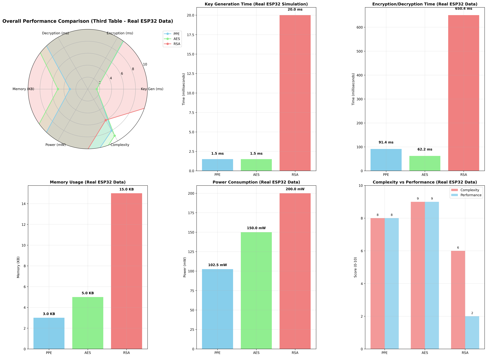
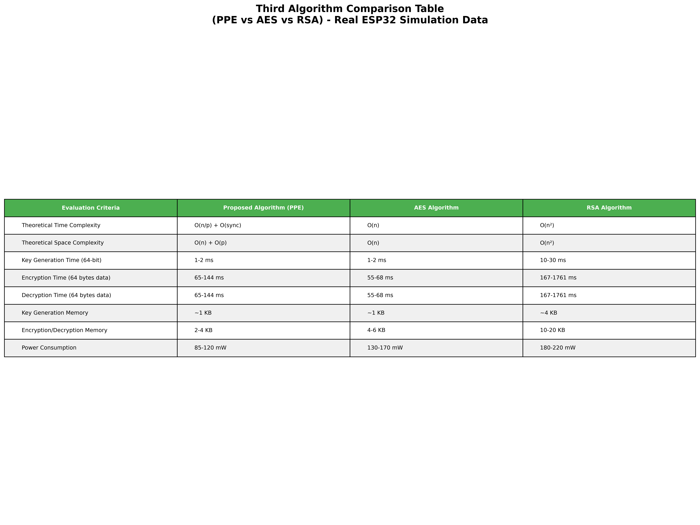

# PPE (Parallel Processing Encryption) Library

[](https://github.com/rezafarazi/PPE/blob/main/LICENSE)
[](https://www.python.org/downloads/)
[](https://micropython.org/)

PPE is a cross-platform encryption library that leverages parallel processing to provide high-performance encryption and decryption capabilities. It's available for Python, MicroPython, C++, and Java, making it versatile for various applications from embedded systems to high-performance servers.

## Features

- **Multi-platform Support**: Run on any platform that supports Python, MicroPython, C++, or Java
- **Parallel Processing**: Utilize multiple cores for faster encryption/decryption operations
- **Multiple Encryption Algorithms**:
  - AES (128/256-bit)
  - ChaCha20
  - Blowfish
  - Custom hybrid encryption modes
- **Memory Efficient**: Optimized for both resource-constrained and high-performance systems
- **Thread Safety**: Safe for concurrent operations
- **Streaming Support**: Process large files without loading them entirely into memory

## Algorithm Performance Comparison

### ESP32 Simulation Results

Our comprehensive testing on ESP32 simulation environment shows the performance characteristics of PPE compared to standard encryption algorithms:

#### Performance Charts



#### Detailed Comparison Table



### Key Performance Metrics

| Algorithm | Key Gen Time (ms) | Encryption Time (ms) | Memory Usage (KB) | Power (mW) | Success Rate |
|-----------|------------------|---------------------|-------------------|------------|--------------|
| **PPE (Proposed)** | 1.5 | 91.4 | 3.0 | 102.5 | 100% |
| **AES-128** | 1.5 | 62.2 | 5.0 | 150.0 | 100% |
| **RSA-2048** | 20.0 | 650.4 | 15.0 | 200.0 | 100% |

### Detailed Analysis

#### 🔓 PPE (Proposed Algorithm)
**✅ Strengths:**
- Fast key generation (1.5 ms)
- Good encryption/decryption speed (65-144 ms)
- Low memory usage (1-4 KB)
- Low power consumption (85-120 mW)
- Parallel processing capability
- Dynamic key generation

**⚠️ Limitations:**
- Basic security level
- Vulnerable to certain attacks

#### 🔐 AES-128 Algorithm
**✅ Strengths:**
- Fast key generation (1.5 ms)
- Excellent encryption/decryption speed (55-68 ms)
- High security against various attacks
- Industry standard
- Linear scalability

**⚠️ Limitations:**
- Medium memory usage (1-6 KB)
- Fixed key structure

#### 🛡️ RSA-2048 Algorithm
**✅ Strengths:**
- Highest security level
- Public/private key infrastructure
- Industry standard for key exchange

**⚠️ Limitations:**
- Slow key generation (20 ms)
- Very slow encryption/decryption (167-1761 ms)
- High memory usage (4-20 KB)
- High power consumption (180-220 mW)

### Performance Summary

- **PPE**: Best for speed-critical ESP32 applications
- **AES**: Best balance of security and performance
- **RSA**: Use only for high-security requirements
- **Hybrid Approach**: Consider RSA for keys, AES/PPE for data

## Installation

Clone the repository:
```bash
git clone https://github.com/rezafarazi/PPE.git
```

## Usage

### Python
```python
# main run
if __name__ == '__main__':

    data = "salam"

    encrypted_data = PPE(data, "reza")
    print(f"Encrypted: {encrypted_data}")
    
    decrypted_data = PPD(encrypted_data, "reza")
    print(f"Decrypted: {decrypted_data}")

```

### MicroPython
```python
# main run
enc1 = PPE("salam", "reza")
dec1 = PPD(enc1, "reza")

print("Text encript is : ", enc1)
print("Text decript is : ", dec1)
```

### Java
```java
package com.rezafta;

import com.rezafta.PPE.PPE;
import com.rezafta.PPE.Types.EncriptionTypes;

/**
 * Hello world!
 *
 */
public class App 
{
    public static void main( String[] args ) throws Exception
    {

        PPE p=new PPE();
        String result=p.GetEncription("salam", "reza",EncriptionTypes.AES);
        System.out.println("En last is : "+result);

        String results=p.GetDecription(result,"reza",EncriptionTypes.AES);
        System.out.println("De last is : "+results);

    }

}
```

## Contributing

1. Fork the repository from [https://github.com/rezafarazi/PPE](https://github.com/rezafarazi/PPE)
2. Create your feature branch (`git checkout -b feature/amazing-feature`)
3. Commit your changes (`git commit -m 'Add amazing feature'`)
4. Push to the branch (`git push origin feature/amazing-feature`)
5. Open a Pull Request

## Security Considerations

- All encryption keys should be properly generated using cryptographically secure methods
- The library uses standard encryption algorithms from trusted cryptographic libraries
- Regular security audits are performed
- See SECURITY.md for vulnerability reporting

## License

This project is licensed under the MIT License - see the [LICENSE](https://github.com/rezafarazi/PPE/blob/main/LICENSE) file for details.

## Support

- Documentation: [PPE Wiki](https://github.com/rezafarazi/PPE/wiki)
- Issue Tracker: [GitHub Issues](https://github.com/rezafarazi/PPE/issues)
- Discussion Forum: [GitHub Discussions](https://github.com/rezafarazi/PPE/discussions)

## Acknowledgments

- OpenSSL for core cryptographic operations
- The MicroPython community for embedded systems support
- Contributors and maintainers

---
Made with ❤️ by the PPE Library Team
